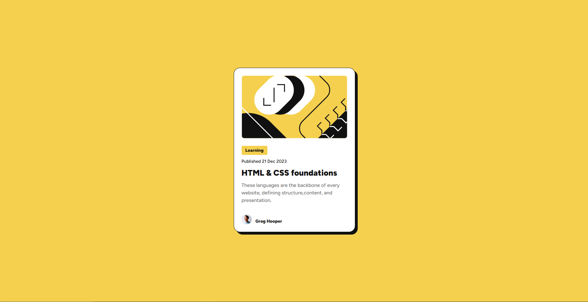

# Frontend Mentor - Blog preview card solution

This is a solution to the [Blog preview card challenge on Frontend Mentor](https://www.frontendmentor.io/challenges/blog-preview-card-ckPaj01IcS). Frontend Mentor challenges help you improve your coding skills by building realistic projects.

## Table of contents

-  [Overview](#overview)
   -  [The challenge](#the-challenge)
   -  [Screenshot](#screenshot)
   -  [Links](#links)
-  [My process](#my-process)
   -  [Built with](#built-with)
   -  [What I learned](#what-i-learned)
   -  [Continued development](#continued-development)
   -  [Useful resources](#useful-resources)
-  [Author](#author)

## Overview

### The challenge

Users should be able to:

-  See hover and focus states for all interactive elements on the page

### Screenshot

### Links

-  Solution URL: [Add solution URL here](https://github.com/Rengrouze/blog-preview-card-main)
-  Live Site URL: [Add live site URL here](https://rengrouze.github.io/blog-preview-card-main/)

## My process

### Built with

-  Semantic HTML5 markup
-  CSS custom properties
-  Flexbox

### What I learned

just like the first project it was more of a reminder than a learning experience

i like my semantic tho, of course i should try to learn what is good pratice in semantic but i guess a lot a companies have their own so i have mine

### Continued development

Maybe i'll add some minor animation on hovering to have a smoother look

### Useful resources

-  [Flexbox documentation](https://developer.mozilla.org/fr/docs/Web/CSS/CSS_flexible_box_layout/Basic_concepts_of_flexbox) - always good to have this

## Author

-  Frontend Mentor - [@Rengrouze](https://www.frontendmentor.io/profile/Rengrouze)
